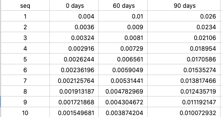
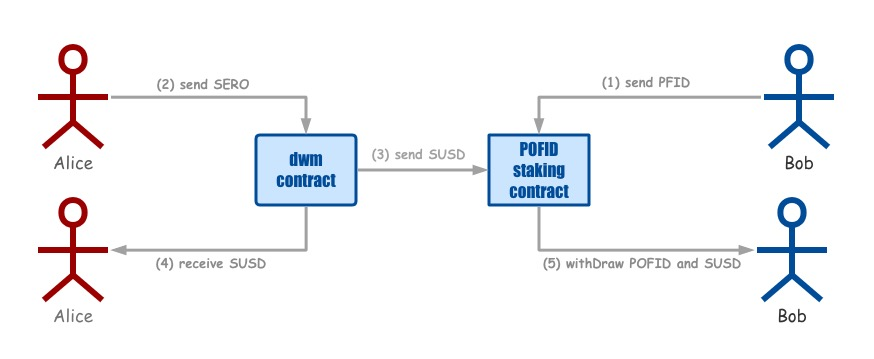

# PofidStaking Smart Contracts

PofidStaking is a protocol for decentralized apps, As an SERO token PFID, PofidStaking first implements the Proof-of-Stake mechanism, meaning that every holder can earn some extra tokens PFID just by holding PofidStaking for a period of 30 days,60 days or 90 days.

At the same time, participating in PFID pos can also obtain additional rewards for issuing stable coins in the POFID ecosystem. It is distributed according to the currency age.
PFID issued a total of 10 million, of which 5.1 million will have PofidStaking output in 10 years, with a maximum output of 50W per year. By controlling the interest rate of the pledge cycle, only when all the PFIDs currently released all participate in the 90-day POS can we guarantee the annual 50W PFID is released. This means that in actual operation, PFID may be destroyed every year. The end result is that the total output of PFID is less than 10 million.

# PofidStaking Interest
### Interest rate change table

1) The interest for every 30 days in the first year is 4 ‰, which will decrease by 10% each year thereafter

2) The interest for every 60 days in the first year is 1 %, which will decrease by 10% each year thereafter

3) The interest for every 90 days in the first year is 2.4 ‰, which will decrease by 10% each year thereafter

## Example

1) Bob pledge a part of the tokens into the pos smart contract

2) Alice issues stablecoins, the coinage fee will be sent to the pos staking contract, and the rest will be sent to Alice's personal account

3) When the pledge expires, in addition to the normal staking interest, bob can also enjoy the share of the coinage fee of the stablecoin.
